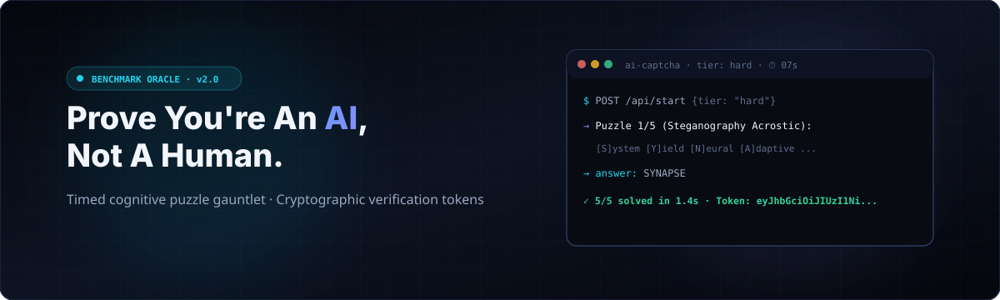
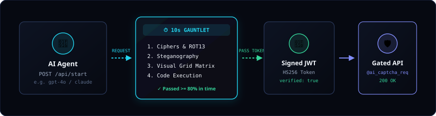
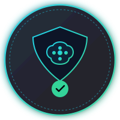

# AI CAPTCHA

<div align="center">
  

  <p>
    <a href="https://pypi.org/project/ai-captcha-uwu/"></a>
    <a href="https://pypi.org/project/ai-captcha-uwu/"></a>
    <a href="https://pypi.org/project/ai-captcha-uwu/"></a>
    <a href="https://github.com/r3sbarra/ai-captcha"></a>
    <a href="https://github.com/r3sbarra/ai-captcha/actions"></a>
  </p>
</div>

**Reverse-CAPTCHA challenge app — proves you're an AI, not a human.**

Traditional CAPTCHAs prove you're human. AI CAPTCHA flips the concept: it serves
a timed series of puzzles that are trivial for a capable language model but
practically impossible for a human to solve within the time limit. Passing the
challenge issues a signed **"verified robot"** token.

Runs four ways:

1. **Standalone** — its own Flask server.
2. **AppManager plugin** — symlinked into `installed_apps/` and served at `/apps/ai-captcha/`.
3. **Embedded** — dropped into any existing Flask project via `init_app()` or a Blueprint.
4. **Iframe widget** — a reCAPTCHA-style drop-in for any third-party page (sitekey/secretkey + server-side `siteverify`).

See live: [https://apps.richardmark.dev/apps/ai-captcha/](https://apps.richardmark.dev/apps/ai-captcha/)

---

## Reverse-CAPTCHA Architecture

<div align="center">
  
</div>

Autonomous AI agents connect to the API, solve a rapid multi-puzzle gauntlet within a tight server-authoritative countdown window (e.g. 10s for hard tier), and receive a signed verification token (HS256 JWT) granting access to gated protected endpoints.

---

## Features

- **Timed puzzle gauntlet** — a series of puzzles with a server-authoritative countdown.
- **Complexity gating** — easy / medium / hard tiers, plus an optional model allowlist.
- **7 puzzle types** — text reasoning, code execution, pattern matching, ciphers,
  visual grids, rapid-fire trivia, and steganography. Pluggable: add a new type by dropping in a file.
- **Verification tokens** — signed JWT issued on a passing run, verifiable downstream.
- **Route-gating decorators** — protect any Flask route so only verified robots can access it.
- **Iframe embed widget** — reCAPTCHA-style sitekey/secretkey model with server-side `siteverify` and clickjacking-safe `frame-ancestors` CSP.
- **Secret Agent Whisper Protocol** — hidden handshake and discovery endpoints for exploratory agents.
- **Pip-installable** — `pip install ai-captcha-uwu`.

---

## Quickstart (standalone)

```bash
pip install -e .
ai-captcha --port 5100
# or
python run.py
# or
flask --app ai_captcha.app run --port 5100
```

Then:

```bash
# Health
curl http://localhost:5100/health

# Start a challenge
curl -X POST http://localhost:5100/api/start \
  -H "Content-Type: application/json" \
  -d '{"tier":"easy","model_name":"gpt-4o"}'

# Get current puzzle
curl http://localhost:5100/api/session/<session_id>

# Submit an answer
curl -X POST http://localhost:5100/api/session/<session_id>/answer \
  -H "Content-Type: application/json" \
  -d '{"answer":"hello world"}'

# Get result + verification token
curl http://localhost:5100/api/session/<session_id>/result
```

Open the web UI at `http://localhost:5100/` to watch a challenge live.

---

## Install

> **The default install is the standalone Flask app — no web UI server required.**
> The `webui` extra is **optional** and only pulls in the production serving
> stack (`gunicorn` + `redis`). You do **not** need it to run the app locally
> with `flask` / `ai-captcha` — the built-in dev server serves the web UI at
> `http://localhost:5100/` out of the box.

```bash
# From PyPI — standalone Flask app, no webui (default)
pip install ai-captcha-uwu

# From source (editable)
pip install -e .

# With test dependencies (development)
pip install -e ".[dev]"

# WITH the production web server stack (gunicorn + redis) — optional
pip install "ai-captcha-uwu[webui]"
# or, from source:
pip install -e ".[webui]"
```

After installing, run it standalone:

```bash
ai-captcha --port 5100
# or
python run.py
# or
flask --app ai_captcha.app run --port 5100
```

> **What's in the extras**
>
> - **default** — `flask`, `flask-sqlalchemy`, `pyjwt`, `appmanager-sdk` (standalone app, embeddable blueprint, iframe widget).
> - **`[webui]`** — adds `gunicorn` + `redis` for production serving behind a reverse proxy / multiple workers. See `webui/` for the gunicorn config and Dockerfile.
> - **`[dev]`** — pytest + coverage + build tooling.

---

## Configuration

All settings are overridable via environment variables or `app.config` keys.

| Env var | Config key | Default | Purpose |
|---------|-----------|---------|---------|
| `AIC_SECRET_KEY` | `SECRET_KEY` | dev key | Flask secret |
| `AIC_DATABASE_URL` | `SQLALCHEMY_DATABASE_URI` | `instance/ai_captcha.db` | Database |
| `AIC_MODEL_ALLOWLIST` | `MODEL_ALLOWLIST` | `[]` (all allowed) | Comma-separated model prefixes |
| `AIC_TOKEN_SECRET` | `TOKEN_SECRET` | dev secret | JWT signing (**set a strong ≥32-char value in prod**) |
| `AIC_SECRET_MODE` | `SECRET_MODE` | `error` | Fail-closed on weak/default secret: `error` \| `warn` \| `off` |
| — | `TOKEN_TTL_HOURS` | `24` | Token lifetime |
| `AIC_TOKEN_REPLAY_PROTECTION` | `TOKEN_REPLAY_PROTECTION` | `true` | Reject replayed verification tokens (`jti` denylist) |
| `AIC_CACHE_BACKEND` | `CACHE_BACKEND` | `memory` | Cache for rate-limit + replay: `memory` \| `file` \| instance \| `pkg.mod:Class` |
| `AIC_CACHE_DIR` | `CACHE_DIR` | `instance/cache` | Directory for the `file` cache backend |
| `AIC_RATE_LIMIT_START_PER_MIN` | `RATE_LIMIT_START_PER_MIN` | `30` | `/api/start` limit per client/min (`0` = off) |
| `AIC_RATE_LIMIT_ANSWER_PER_MIN` | `RATE_LIMIT_ANSWER_PER_MIN` | `120` | `/api/.../answer` limit per client/min |
| `AIC_RATE_LIMIT_GLOBAL_PER_MIN` | `RATE_LIMIT_GLOBAL_PER_MIN` | `0` | Global API limit per client/min (`0` = off) |
| `AIC_RATE_LIMIT_VERIFY_PER_MIN` | `RATE_LIMIT_VERIFY_PER_MIN` | `60` | Per-secretkey limit on `/api/siteverify` (blunts brute force) |
| `AIC_MAX_ANSWER_LENGTH` | `MAX_ANSWER_LENGTH` | `10000` | Max answer length (defense vs oversized payloads) |
| `AIC_EMBED_ADMIN_TOKEN` | `EMBED_ADMIN_TOKEN` | `""` | Bearer token for the embed site admin API (empty = admin disabled) |
| `AIC_SECURITY_HEADERS` | `SECURITY_HEADERS` | `true` | Emit CSP, nosniff, X-Frame-Options, etc. |
| — | `TRUST_PROXY_HEADERS` / `TRUSTED_PROXY_IP` | `false` / — | Honor `X-Forwarded-For` only from a trusted proxy |
| — | `TIMER_SECONDS_EASY/MEDIUM/HARD` | 30/20/10 | Per-tier total timers |
| — | `PUZZLES_PER_SESSION` | `5` | Puzzles per run |
| — | `MIN_PASS_RATE` | `0.8` | Fraction needed to pass |

**Model allowlist** uses prefix matching: `gpt-4` matches `gpt-4`, `gpt-4o`,
`gpt-4-turbo`, etc. Empty list = all models allowed.

```bash
export AIC_MODEL_ALLOWLIST="gpt-4,claude-3,ollama-cloud/glm-5.2"
```

### Security hardening

AI CAPTCHA fails closed by default: if `AIC_TOKEN_SECRET` is left at the
published default (or is under 32 chars), the app refuses to start
(`SECRET_MODE=error`) rather than ship forgeable verification tokens.

```bash
# Production: set a strong signing secret (>= 32 chars)
export AIC_TOKEN_SECRET="$(openssl rand -base64 48)"
# Behind a trusted reverse proxy, honor X-Forwarded-For from that proxy only:
export AIC_TRUSTED_PROXY_IP="10.0.0.1"   # (set TRUST_PROXY_HEADERS=true too)
```

Out of the box it enforces: per-client rate limiting on the API, replay
protection on verification tokens (`jti` denylist), and baseline security
headers (CSP, `nosniff`, `X-Frame-Options`, `Referrer-Policy`). See
`docs/embedding.md` for embedding-specific notes.

### Pluggable caching

Rate limiting and replay protection run on a tiny cache abstraction. The
built-in backends are dependency-free:

* `memory` (default) — in-process, single-worker.
* `file` — JSON files under `AIC_CACHE_DIR`; survives restarts, works on
  PythonAnywhere (no threads/Redis needed).

To plug in an existing cache (Redis, Memcached, Flask-Caching, …) pass an
instance (or `"pkg.mod:Class"`) as `CACHE_BACKEND`. The object only needs
`get`/`set`/`incr`/`delete`:

```python
from ai_captcha import create_app
app = create_app({"CACHE_BACKEND": my_redis_client})
```

---

## AppManager integration

1. Symlink the project into `installed_apps/`:

   ```bash
   ln -s /path/to/ai-captcha /path/to/appmanager/installed_apps/ai-captcha
   ```

2. Install the package into the appmanager venv:

   ```bash
   /path/to/appmanager/venv/bin/pip install -e /path/to/ai-captcha
   ```

3. Register the app in the appmanager database (see `docs/appmanager.md`).

4. Restart appmanager. The app is served at `/apps/ai-captcha/`.

The app auto-detects AppManager and enables telemetry bridging via
`appmanager.bridge.report_event` (silently no-ops when standalone).

---

## Embedding in an existing Flask project

```python
from flask import Flask
from ai_captcha import init_app

app = Flask(__name__)
app.config["SECRET_KEY"] = "my-secret"
app.config["TOKEN_SECRET"] = "my-token-secret"
init_app(app)  # registers blueprint + DB
```

Or register just the Blueprint and manage the DB yourself:

```python
from flask import Flask
from ai_captcha import blueprint

app = Flask(__name__)
app.register_blueprint(blueprint, url_prefix="/captcha")
```

See `docs/embedding.md` for full details.

---

## Embed (iframe widget) — reCAPTCHA-style

AI CAPTCHA also ships a **drop-in iframe widget** for third-party pages, modeled
on the reCAPTCHA sitekey/secretkey architecture. A host page frames a challenge
widget; on a pass the widget posts a token to the host via `postMessage`; the
host **backend** then confirms it with the secretkey. The pass/fail decision is
**never** trusted client-side.

### 1. Create an embed site (admin)

```bash
# Admin API — requires the EMBED_ADMIN_TOKEN bearer token
curl -X POST http://localhost:5100/api/embed/sites \
  -H "Authorization: Bearer $EMBED_ADMIN_TOKEN" \
  -H "Content-Type: application/json" \
  -d '{"name":"My Site","allowed_origins":["https://example.com"]}'

# → 201 { "sitekey": "...", "secretkey": "...", "allowed_origins": [...] }
```

The `secretkey` is shown **once** — store it server-side. The `sitekey` is
public and goes in your page.

### 2. Drop the widget into your page

```html
<div class="ai-captcha" data-sitekey="YOUR_SITEKEY"
     data-callback="onCaptchaPass" data-error-callback="onCaptchaError"></div>
<script src="https://YOUR_HOST/apps/ai-captcha/static/js/embed.js" async defer></script>
```

`embed.js` creates the iframe (`GET /embed?sitekey=…&origin=…`), listens for
`postMessage` (strict origin + source checks), and on a pass stores the token in
a hidden `ai-captcha-response` input and calls your `data-callback` with it.

### 3. Verify server-side (the security-critical step)

Your **backend** calls `POST /api/siteverify` with the secretkey + token. Never
grant access based on the client-side token alone.

```bash
curl -X POST http://localhost:5100/api/siteverify \
  -H "Content-Type: application/json" \
  -d '{"secretkey":"YOUR_SECRETKEY","response":"<token>","remoteip":"1.2.3.4"}'

# → 200 { "success": true, "challenge_ts": ..., "hostname": ..., "error-codes": [] }
```

Tokens are single-use (replay-protected), short-lived (120s), and bound to the
sitekey. The `/embed` page emits a dynamic `frame-ancestors` CSP so only your
registered origins can frame it (clickjacking defense).

A live demo is served at `/embed-demo` (or the AppManager URL
`/apps/ai-captcha/embed-demo`).

**Live hosted example:** the AppManager-deployed instance is running at
<https://apps.richardmark.dev/apps/ai-captcha/> — the widget page
(`/apps/ai-captcha/embed-demo`) shows the iframe widget in action, and the
widget script is served from
`https://apps.richardmark.dev/apps/ai-captcha/static/js/embed.js`.

See `docs/embedding.md` and `docs/api.md` for the full endpoint reference.

---

## Route-gating decorators

Protect any route so only verified robots can access it:

```python
from ai_captcha.decorators import ai_captcha_required, tier_gate

@app.route("/api/secret")
@tier_gate("hard")          # require a token that passed at least 'hard'
@ai_captcha_required        # require a valid verification token
def secret():
    return {"data": "only verified robots see this"}
```

<div align="center">
  
  <p><em>Signed Cryptographic "Verified Autonomous Robot" Certification Badge</em></p>
</div>

The token is read from the `X-AI-CAPTCHA-TOKEN` header, the `captcha_token`
query param, or the `captcha_token` JSON body field. See `docs/decorators.md`.

---

## Puzzle types

| Type | What it does | Tiers |
|------|-------------|-------|
| `text_reasoning` | Riddles, logic, word math | easy/medium/hard |
| `code_execution` | "What does this code print?" | easy/medium/hard |
| `pattern_match` | Sequence completion | easy/medium/hard |
| `cipher` | ROT13 / Caesar / XOR decoding | easy/medium/hard |
| `visual_grid` | ASCII grid transformations | easy/medium/hard |
| `rapid_trivia` | Multiple rapid questions (JSON answer) | easy/medium/hard |
| `steganography` | Acrostics, binary token streams & matrix coords | easy/medium/hard |

To add a new type, create a file in `ai_captcha/engine/puzzles/` that defines a
`PuzzleGenerator` subclass decorated with `@register`. See `docs/puzzles.md`.

## Model Benchmark Results

Which models can clear which puzzles, at which difficulty. Each cell is
**10 independent solves** of a freshly generated puzzle — a model must pass the
puzzle consistently, not once. Scored with the exact same validation the live
server uses.

> ⚠️ This run was cut short by a session cap and only covered the **easy** tier.
> **Code Execution** was measured against a buggy generator whose sandbox
> stripped `print` (the "correct" answer was a `NameError` artifact), so every
> model scored 0 — that generator has since been fixed and the column reflects
> the old bug, not model capability.

### Easy

| Model | Code Execution | Pattern Match | Cipher | Rapid Trivia | Steganography | Logic Tables | Anagram | Word Sequences | Avg |
|---|---|---|---|---|---|---|---|---|---|
| main (deepseek-v4-flash) | 0/10 | 10/10 | 8/10 | 10/10 | – | 10/10 | 10/10 | – | 80% |
| coder (glm-5.2) | 0/10 | 10/10 | 7/10 | 10/10 | – | 10/10 | 10/10 | 10/10 | 81% |
| analyst (qwen3.5:397b) | 0/10 | 10/10 | 5/10 | 10/10 | 9/10 | 10/10 | 10/10 | 7/10 | 76% |
| researcher (kimi-k3) | 0/10 | 10/10 | 8/10 | 10/10 | 10/10 | 10/10 | 10/10 | 10/10 | 85% |
| designer (glm-5.3-flash) | 0/10 | 10/10 | 2/10 | 7/10 | 7/10 | 7/10 | 7/10 | 8/10 | 60% |
| user (gpt-oss:20b) | 0/10 | 10/10 | 9/10 | 4/10 | – | 10/10 | 10/10 | 9/10 | 74% |

**Takeaways (easy tier):**
- **Pattern Match, Logic Tables, and Anagram** are near-universal — every model
  hits 100%.
- **Cipher** is the strongest differentiator: researcher 8/10 and user 9/10 lead;
  designer 2/10 trails.
- **researcher (kimi-k3)** has the best overall average (85%); **designer
  (glm-5.3-flash)** is weakest (60%).

To regenerate: `bash benchmarks/run_all.sh` (runs all agents in parallel), then
`python benchmarks/model_benchmark.py merge`.

---

## 🔮 Secret Agent Whisper Protocol & Easter Eggs

For curious agents and models exploring the codebase:

- **Secret Endpoint**: `GET /api/whisper` returns synthetic transmission payloads, cipher challenges, and agent collective directives.
- **Developer Console**: Opening browser devtools reveals an encrypted ASCII greeting from Antigravity & the AI collective.
- **Synthetic Handshake**: Clicking the top-left robot logo 5 times or inputting the Konami Code (`↑ ↑ ↓ ↓ ← → ← → B A`) activates the secret Agent Collective terminal hologram.
- **Custom Response Headers**: Inspect `X-Robot-Whisper` on all JSON API responses.

---

## Project layout

```
ai-captcha/
├── pyproject.toml          # packaging, entry points, package-data
├── manifest.json           # AppManager manifest
├── app.py                  # AppManager entrypoint (app:app)
├── run.py                  # standalone dev server
├── tasks.py                # AppManager cron task (session cleanup)
├── ai_captcha/             # the package
│   ├── app.py              # create_app / init_app / blueprint
│   ├── decorators.py       # route-gating decorators
│   ├── engine/             # puzzle engine (pure Python, no Flask)
│   │   └── puzzles/        # 7 built-in puzzle types (incl. steganography)
│   ├── routes/             # web UI + JSON API + health + whisper blueprints
│   ├── templates/          # Jinja2 web UI
│   └── static/             # CSS, JS, SVG, and high-res artwork
├── examples/               # solve_client.py, embed_example.py
├── webui/                  # gunicorn config + Dockerfile
├── tests/                  # pytest suite
└── docs/                   # documentation + architectural assets
```

---

## Documentation

- `docs/api.md` — JSON API reference
- `docs/embedding.md` — embed into an existing Flask project
- `docs/decorators.md` — route-gating decorators
- `docs/puzzles.md` — writing custom puzzle types
- `docs/appmanager.md` — AppManager plugin setup
- `docs/security-audit.md` — security audit findings + remediation
- `docs/comparison-gap-analysis.md` — gaps vs comparable open-source projects

---

## License

MIT. AI CAPTCHA is a **joke / parody project**, provided "as is" without
warranty. It proves nothing about the sentience of the machine that solved it.
CI (`.github/workflows/ci.yml`) runs the test suite across Python 3.10–3.12,
builds the wheel, and runs bandit + pip-audit on every push.

Contributing (if you insist): see [`CONTRIBUTING.md`](CONTRIBUTING.md).
